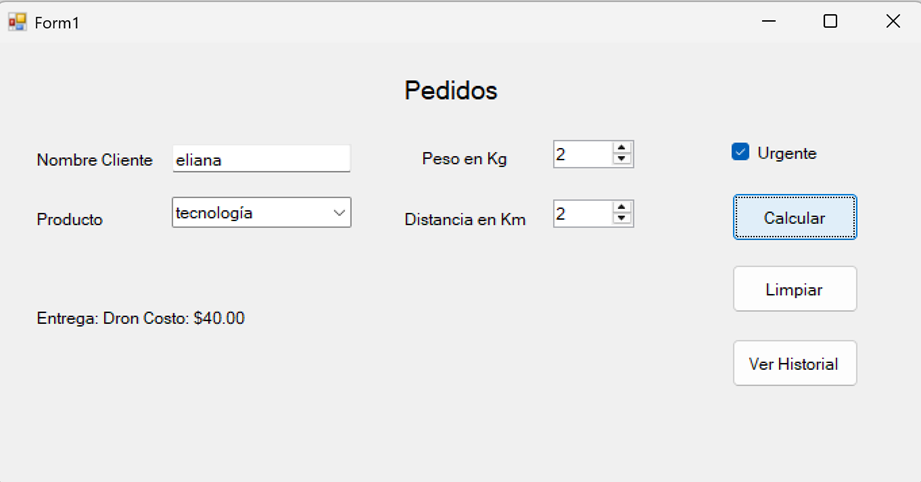
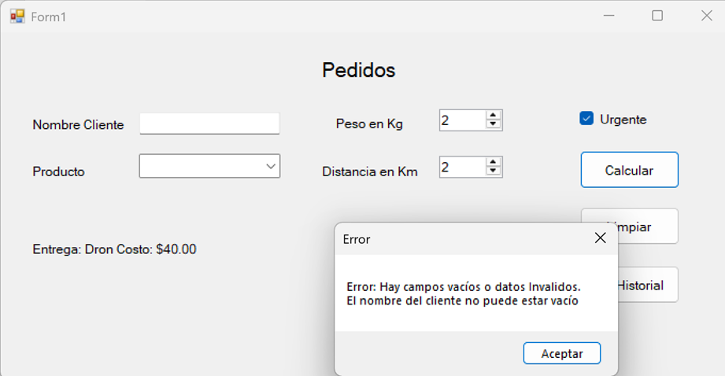

# Aplicación de Gestión de Pedidos - Windows Forms (C#)

## 📦 Propósito

Esta aplicación de escritorio permite gestionar pedidos de productos utilizando diferentes estrategias de entrega. Está diseñada para simular el cálculo de costos de envío según el tipo de producto, su peso, urgencia y distancia, aplicando el patrón Strategy y Singleton.

---

## ✅ Funcionalidades

- Registro de pedidos con datos del cliente, producto, peso, urgencia y distancia.
- Cálculo automático del costo de entrega utilizando:
  - 🚚 Camión
  - 🛵 Motocicleta
  - 🚁 Dron
  - 🚲 Bicicleta (entrega ecológica)
- Historial de pedidos visualizado en un formulario adicional.
- Filtro por tipo de entrega en el historial mediante un ComboBox.
- Validación de entradas y manejo de errores.

---

## ▶️ Instrucciones de Ejecución

1. **Abre la aplicación.**
2. En la pantalla principal, completa los siguientes campos:
   - **Cliente**: escribe el nombre del cliente.
   - **Producto**: selecciona el tipo de producto (tecnología, accesorio, componente).
   - **Urgente**: marca si la entrega es urgente.
   - **Peso**: selecciona el peso del producto.
   - **Distancia**: indica cuántos kilómetros debe recorrer la entrega.
3. Haz clic en el botón **"Calcular"** para ver el tipo de entrega asignado y su costo.
4. Si deseas ver todos los pedidos realizados:
   - Haz clic en el botón **"Ver historial"**.
   - Puedes usar el menú desplegable para filtrar los pedidos por tipo de entrega.

---

## 🧩 Patrones de Diseño Utilizados

- **Strategy**: Permite cambiar dinámicamente el método de entrega.
- **Singleton**: Asegura una única instancia del registro de pedidos.

## Capturas de pantalla

